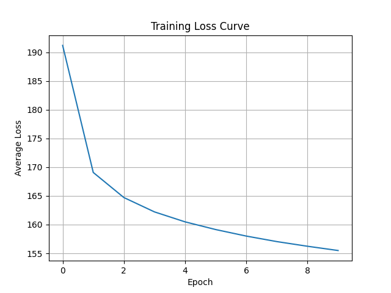
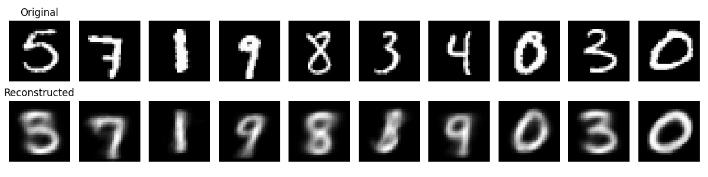
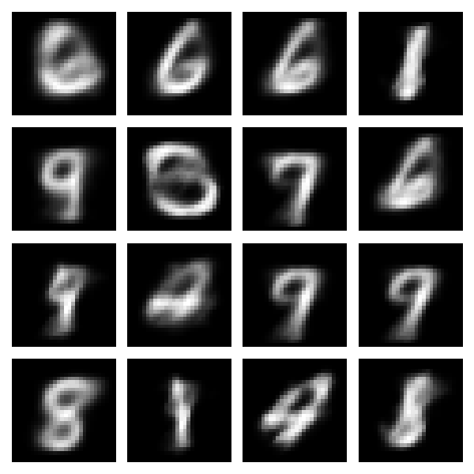
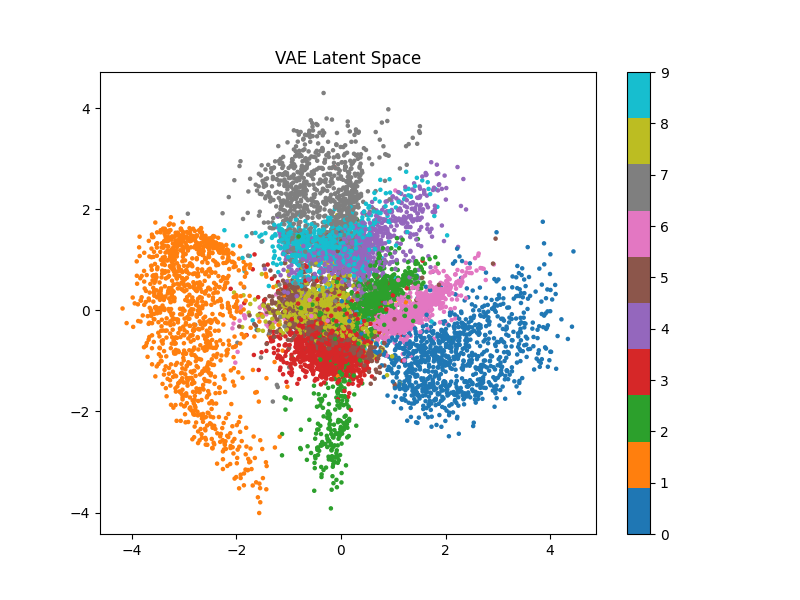

# Variational Autoencoder (VAE) on MNIST

## Project Overview

This project implements a Variational Autoencoder (VAE) using PyTorch to learn compressed latent representations of handwritten digits from the MNIST dataset.

The model learns to:

- Encode images into a latent space
- Sample latent vectors
- Reconstruct handwritten digits
- Generate new handwritten digits

---

## Dataset

MNIST Handwritten Digits Dataset

- 60,000 training images
- 10,000 test images
- Image size: 28 × 28 pixels

---

## Model Architecture

Encoder:

784 → 400 → μ, log(σ²)

Latent Dimension:

2

Decoder:

2 → 400 → 784

Activation Functions:

- ReLU
- Sigmoid

---

## Loss Function

The VAE is trained using ELBO loss:

Loss = Reconstruction Loss + KL Divergence

---

## Results

### Training Loss Curve



### Reconstruction Results



### Generated Digits



### Latent Space Visualization



---

## Requirements

Install dependencies:

```bash
pip install -r requirements.txt